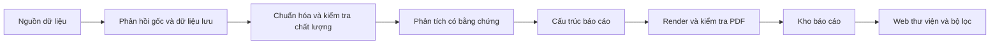

# Kiến trúc nền tảng

## Luồng mục tiêu

Đã chạy: thu thập DNSE/CafeF hiện có, lưu trữ/kiểm kê/xuất CSV,
đăng ký PDF có sẵn, kho metadata và web bộ lọc.
Chuẩn hóa chỉ số, nguồn tin/vĩ mô/ngành, bộ phân tích và renderer PDF chưa triển khai.
Mở web không kích hoạt bộ thu thập. Luồng tạo PDF đầy đủ chỉ được nối khi các module thực hoàn thành.

## Ranh giới module

| Module | Trách nhiệm | Ràng buộc |
|---|---|---|
| `core` | Settings từ gốc dự án/.env, lỗi dùng chung | Không tải dữ liệu khi import |
| `domain` | Kiểu dữ liệu thị trường, quan sát, nguồn, hồ sơ doanh nghiệp | Quan sát giữ đơn vị, kỳ, nguồn và chất lượng |
| `data_sources` | Adapter DNSE/CafeF, phản hồi gốc, Protocol cho nguồn mới | Không đưa logic định giá vào adapter |
| `storage` | Lưu thị trường, inventory và ReportCatalog | PDF có đường dẫn canonical, kiểm tra phạm vi thư mục |
| `analysis` | Inputs, sections, findings và AnalysisEngine | Nhận định thực tế có bằng chứng; giả định tách riêng |
| `reports` | Metadata, nội dung báo cáo và PdfRenderer | Ba loại stock/industry/macro; kiểm tra phần bắt buộc |
| `pipeline` | Điều phối collection, import và publication | Tạo/công bố chỉ khi có renderer thực được truyền vào |
| `web` | Hiển thị và API đọc catalog | Không truy cập khóa DNSE, không gọi API nguồn |

Giữ một package và một tiến trình web cho đồ án. Không chia microservice ở giai đoạn này.
`run.ps1` chuẩn bị môi trường và gọi `run.py`; CLI lựa chọn đúng tác vụ.
Đường dẫn tương đối trong cấu hình giải theo gốc dự án, không theo thư mục đang mở của người dùng.

## Dữ liệu thị trường và kho báo cáo

`var/market_data.db` giữ dữ liệu đã thu thập và schema cũ.
`var/reports.db` mới chỉ chứa metadata PDF; không di trú hay sửa dữ liệu thị trường
để mở thư viện báo cáo. PDF được sao chép vào `outputs/reports/<UUID>.pdf`.
Ngày chốt dữ liệu (`as_of`) khác thời điểm đăng ký (`created_at`).

Catalog kiểm tra tiền tố `%PDF-`, tính SHA-256, sao chép tệp rồi ghi metadata.
Nếu ghi metadata thất bại, bản sao được xóa. Tiền tố PDF không thay thế việc
render/kiểm tra nội dung. Khi serving PDF, UUID phải hợp lệ và đường dẫn phải
nằm trong thư mục PDF cấu hình. Các tệp khác và đường dẫn ngoài thư mục bị chặn.

Hệ thống chưa có recovery cho crash giữa sao chép và commit hoặc publisher đồng thời.
Lịch sử phiên bản/cập nhật catalog và lịch chạy nền cần đặc tả ở task sau.

## API thư viện

| Phương thức/đường dẫn | Chức năng |
|---|---|
| `GET /` | HTML thư viện, bộ lọc và trạng thái trống |
| `GET /api/health` | Trạng thái web |
| `GET /api/reports` | Danh sách có phân trang/lọc |
| `GET /api/reports/{report_id}` | Metadata báo cáo |
| `GET /api/reports/{report_id}/pdf` | Xem PDF; thêm `?download=true` để tải |

Bộ lọc: `kind`, `symbol`, `industry_id`, `query`, `date_from`, `date_to`.
Phân trang: `page` từ 1, `page_size` từ 1 đến 100. Phản hồi danh sách gồm
`items`, `total`, `page`, `page_size`. Khoảng ngày đảo ngược trả 422;
báo cáo/UUID không có trả 404. Lỗi HTTP/validation trả JSON chứa `error`.
Thông tin công ty và ngành hiện là metadata của báo cáo, chưa phải danh mục doanh nghiệp đầy đủ.

Web có escape HTML, CSP và các header bảo vệ hiển thị;
chỉ phục vụ localhost và không có endpoint upload hoặc ghi catalog.

## Cơ sở thiết kế

FastAPI phục vụ API, Jinja2 tạo trang thư viện, StaticFiles phục vụ CSS;
Uvicorn chạy ứng dụng. Kiểm thử API dùng TestClient; browser QA dùng Edge qua Playwright.
Không có frontend build riêng ở giai đoạn này.

Tham khảo chính thức: [FastAPI templates](https://fastapi.tiangolo.com/advanced/templates/),
[static files](https://fastapi.tiangolo.com/tutorial/static-files/),
[testing](https://fastapi.tiangolo.com/tutorial/testing/),
[Uvicorn settings](https://www.uvicorn.org/settings/).
