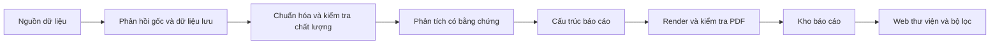

# Kiến trúc nền tảng

## Luồng mục tiêu

Đã chạy: thu thập DNSE/CafeF hiện có, lưu trữ/kiểm kê/xuất CSV,
đăng ký PDF có sẵn, kho metadata và web bộ lọc; thu thập tin RSS/Atom/listing,
phân ngành doanh nghiệp và snapshot thống kê ngành DNSE.
Đã nối bộ phân tích vĩ mô/ngành/cổ phiếu, hồ sơ kiểm chứng tài chính, định giá theo
kịch bản P/B/P/E và renderer PDF A4 nhúng font tiếng Việt. World Bank cung cấp chuỗi năm.
Web khởi động collector tin khi `NEWS_AUTO_UPDATE=true`; giá/BCTC và ngành dùng lệnh riêng.
CLI và web cùng gọi `pipeline/research_reports.py`; không có bộ tạo báo cáo thứ hai.

## Ranh giới module

| Module | Trách nhiệm | Ràng buộc |
|---|---|---|
| `core` | Settings từ gốc dự án/.env, lỗi dùng chung | Không tải dữ liệu khi import |
| `domain` | Kiểu dữ liệu thị trường, quan sát, nguồn, hồ sơ doanh nghiệp | Quan sát giữ đơn vị, kỳ, nguồn và chất lượng |
| `data_sources` | Adapter DNSE/CafeF/ngành và RSS/Atom/listing, phản hồi gốc | Không đưa logic định giá vào adapter |
| `storage` | Thị trường, ngành, tin, inventory và ReportCatalog | Tin/metadata PDF/snapshot ngành dùng SQLite riêng |
| `analysis` | Inputs, sections, findings và AnalysisEngine | Nhận định thực tế có bằng chứng; giả định tách riêng |
| `reports` | Metadata, nội dung báo cáo và PdfRenderer | Ba loại stock/industry/macro; kiểm tra phần bắt buộc |
| `pipeline` | Điều phối collection, import và publication | Tạo/công bố chỉ khi có renderer thực được truyền vào |
| `web` | Hiển thị/API đọc catalog và tin; quản lý vòng đời news runner | Request đọc dữ liệu đã lưu; không gọi nguồn trong request |

Giữ một package và một tiến trình web cho đồ án. Không chia microservice ở giai đoạn này.
`run.ps1` chuẩn bị môi trường và gọi `run.py`; CLI lựa chọn đúng tác vụ.
Đường dẫn tương đối trong cấu hình giải theo gốc dự án, không theo thư mục đang mở của người dùng.

## Dữ liệu thị trường và kho báo cáo

`var/market_data.db` giữ dữ liệu đã thu thập và schema cũ.
`var/reports.db` mới chỉ chứa metadata PDF; không di trú hay sửa dữ liệu thị trường
để mở thư viện báo cáo. PDF được sao chép vào `outputs/reports/<UUID>.pdf`.
Ngày chốt dữ liệu (`as_of`) khác thời điểm đăng ký (`created_at`).

Catalog kiểm tra tiền tố `%PDF-`, tính SHA-256, sao chép tệp rồi ghi metadata.
Nếu ghi metadata thất bại, bản sao được xóa. Tiền tố PDF không thay thế việc
render/kiểm tra nội dung. Khi serving PDF, UUID phải hợp lệ và đường dẫn phải
nằm trong thư mục PDF cấu hình. Các tệp khác và đường dẫn ngoài thư mục bị chặn.

Bộ tạo báo cáo có khóa tiến trình; tác vụ web có một worker và tối đa ba lượt chờ/chạy.
Snapshot phân tích được ghi bằng thay thế tệp nguyên tử sau xuất bản; nếu máy dừng giữa
đăng ký PDF và ghi snapshot, PDF còn đọc được nhưng cần tạo lại để phục hồi snapshot.
Lịch sử phiên bản/cập nhật catalog và lịch chạy nền cần đặc tả ở task sau.

## API thư viện

| Phương thức/đường dẫn | Chức năng |
|---|---|
| `GET /` | HTML thư viện, bộ lọc và trạng thái trống |
| `GET /reports/{report_id}` | Trang chi tiết và preview PDF |
| `POST /api/report-jobs` | Tạo báo cáo từ JSON; trả 202 với ID tác vụ |
| `GET /api/report-jobs/{id}` | Trạng thái và các báo cáo hoàn tất |
| `GET /api/reports/{id}/analysis` | Nội dung công khai và số trang, không trả toàn bộ raw inputs |
| `GET /api/health` | Trạng thái web |
| `GET /api/reports` | Danh sách có phân trang/lọc |
| `GET /api/reports/{report_id}` | Metadata báo cáo |
| `GET /api/reports/{report_id}/pdf` | Xem PDF; thêm `?download=true` để tải |
| `GET /news` | Trang tin và bộ lọc độc lập |
| `GET /api/news` | Tin với region/source_id/symbol/query/page/page_size |
| `GET /api/news/sources` | Trạng thái và lịch cập nhật nguồn; không lộ cấu hình bí mật |

Bộ lọc: `kind`, `symbol`, `industry_id`, `query`, `date_from`, `date_to`.
Phân trang: `page` từ 1, `page_size` từ 1 đến 100. Phản hồi danh sách gồm
`items`, `total`, `page`, `page_size`. Khoảng ngày đảo ngược trả 422;
báo cáo/UUID không có trả 404. Lỗi HTTP/validation trả JSON chứa `error`.
Thông tin công ty và ngành hiện là metadata của báo cáo, chưa phải danh mục doanh nghiệp đầy đủ.

Web có escape HTML, CSP và các header bảo vệ hiển thị;
chỉ phục vụ localhost; kiểm tra Host và Origin với yêu cầu tạo PDF. Không có upload tệp
hoặc tải URL tùy ý từ giao diện. Endpoint tạo chỉ đọc nguồn đã lưu và ghi báo cáo qua publisher.

## Cơ sở thiết kế

FastAPI phục vụ API, Jinja2 tạo trang thư viện, StaticFiles phục vụ CSS;
Uvicorn chạy ứng dụng. Kiểm thử API dùng TestClient; browser QA dùng Edge qua Playwright.
Không có frontend build riêng ở giai đoạn này.

Chi tiết nguồn, ánh xạ module `market-pulse` và giới hạn dữ liệu ngành ở
[DATA_NEWS.md](DATA_NEWS.md). Collector tin chạy trong thread có giới hạn HTTP/timeouts,
khóa tiến trình và stop event. Nhiều web có thể đọc cùng kho; chỉ một collector tin được chạy.

Tham khảo chính thức: [FastAPI templates](https://fastapi.tiangolo.com/advanced/templates/),
[static files](https://fastapi.tiangolo.com/tutorial/static-files/),
[testing](https://fastapi.tiangolo.com/tutorial/testing/),
[Uvicorn settings](https://www.uvicorn.org/settings/).

Phương pháp và hồ sơ đầu vào: [RESEARCH_METHODS.md](RESEARCH_METHODS.md).
